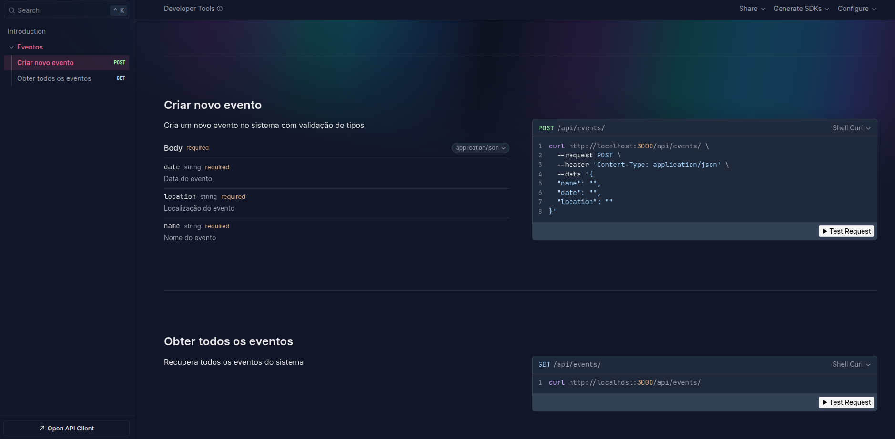

# Testando Elysia em uma simples API de Eventos

## Se trata de uma API que disponibiliza tres endpoints um para criar , outro para listar eventos e para deletar um evento.

# Tecnologias Usadas:

[Bun](https://bun.com/) - RunTime Js   
[Elysia](https://elysiajs.com/) - Framework web   
[Zod](https://zod.dev/) - Criacao e Validacao de Schemas/Types  

## Como usar

Clone o projeto
```bash
git clone https://github.com/DanielDeAzevedoCordeiro1/Testando-Elysia.git
```

Entre na pasta do projeto

```bash
cd Testando-elysia
```

Instale as dependencias

```bash
bun install
```

Suba o servidor

```bash
bun run dev
```

Acesse a docs gerada no endpoint

```bash
http://localhost:3000/docs
```



## Importante 

Um dos diferenciais do Bun é ser um runtime que executa TypeScript nativamente, sem a necessidade de transpilar previamente para JavaScript ou ter o Node.js instalado. Além disso, o Bun oferece suporte à geração de binários executáveis, o que pode ser interessante em cenários específicos de distribuição (Nuvem) e uso de recursos.

### Gere um binario executavel

Faca o build do projeto

```bash
bun run build
```

Acesse a pasta recem criada (build/events-api)

```bash
cd build
```

Rode o executavel

```bash
./events-api
```

## Extra (Container docker)

Gere uma imagem na raiz do projeto rodando:

```bash
docker build -t "nome-da-imagem ."
```

Suba seu container com a imagem criada:

```bash
docker run --name "nome-do-container" -p 3000:3000 "nome-da-imagem"
```
